## RNN(Recurrent Neural Networks循环神经网络)

循环神经网络的主要用途是处理和预测序列数据，在全连接神经网络或卷积神经网络中，网络结果都是从输入层到隐含层再到输出层，层与层之间是全连接或部分连接的，但每层之间的结点是无连接的。考虑这样一个问题，如果要预测句子的下一个单词是什么，一般需要用到当前单词以及前面的单词，因为句子中前后单词并不是独立的，比如，当前单词是“很”，前一个单词是“天空”，那么下一个单词很大概率是“蓝”。循环神经网络的来源就是为了刻画一个序列当前的输出与之前信息的关系。从网络结果上来说，RNN会记忆之前的信息，并利用之前的信息影响后面的输出。也就是说，RNN的隐藏层之间的结点是有连接的，隐藏层的输入不仅包括输入层的输出，还包含上一时刻隐藏层的输出。

<!--more-->

典型的RNN结构如下图所示，对于RNN来说，一个非常重要的概念就是时刻，RNN会对于每一个时刻的输入结合当前模型的状态给出一个输出，从图中可以看出，RNN的主体结构A的输入除了来自输入层的Xt,还有一个循环的边来提供当前时刻的状态。同时A的状态也会从当前步传递到下一步。

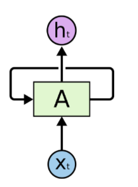

带循环的递归神经网络

这些循环使得循环神经网络看起来很神秘。 然而，如果你再多考虑一下，你就会发现其实它和传统的神经网络并不是完全不同。 一个循环神经网络可以被认为是同一个网络的多个副本，每一个都传递一个消息给后继者。 我们考虑一下如果将循环展开会发生什么：(示意如下)

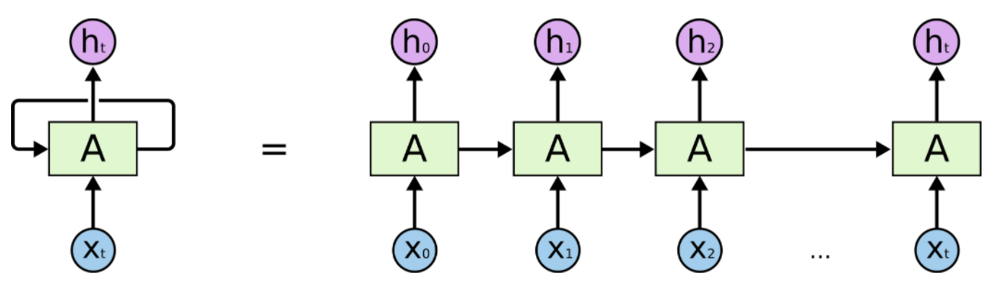

循环神经网络的展开式

这种链状特征揭示了循环神经网络与序列和列表密切相关。 它们是用于此类数据的自然神经网络结构。

他们肯定是有用的！ 在过去的几年里，RNN应在语音识别、语言建模、翻译，图像字幕等各种问题上取得了巨大成功。在Andrej Karpathy的这篇博文——[RNN的难以理解的有效性(The Unreasonable Effectiveness of Recurrent Neural Networks)](https://link.jianshu.com?t=http://karpathy.github.io/2015/05/21/rnn-effectiveness/)中讨论了RNN取得的惊人成果，他们真的很神奇

这些成功的案例的共同点就是都是用了LSTM，这是一种非常特殊的循环神经网络，对于许多任务来说，它们比基准版本好的多。 几乎所有令人兴奋的结果都是基于循环神经网络实现的，这篇文章将探讨这些LSTM，带你解开LSTM的神秘面纱。

## 长依赖存在的问题

RNN显著的魅力是将以前的信息连接到当前任务的这种思路，例如使用先前的视频帧可以有助于对当前帧的理解。 如果RNN可以做到这一点，这将非常有用。 但他可以吗？这要看情况。

有时，为了处理当前的任务，我们只需要查看最近的信息。 例如，考虑一种语言模型，该模型根据前面的词语来预测下一个单词。 如果我们试图预测““the clouds are in the sky”的最后一个单词，我们不需要任何其他的语境信息——下一个单词显然是sky。 在相关信息和需要该信息的距离较近的时候，RNN能够学会去利用历史信息。

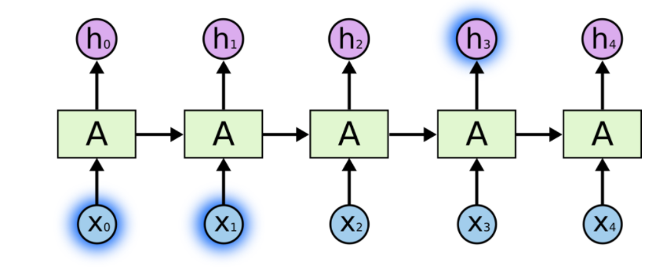

但也有需要更多上下文的情况。 考虑尝试预测文本中的最后一个单词“I grew up in France… I speak fluent French.”。最近的信息表明，下一个单词可能是一种语言的名称，但如果我们想缩范围确定那种语言，我们需要从前面获取法国的背景。 相关信息和需要该信息的地方的距离变得非常大的情况是很可能的。

不幸的是，随着距离的增加，RNN无法有效的利用历史信息。

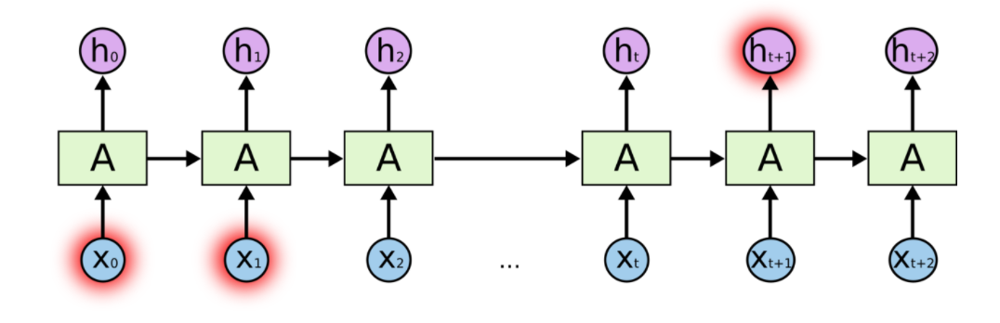

在理论上，RNN绝对有能力处理这样的“长依赖”问题。人们可以仔细挑选参数来解决这种形式的问题。 可悲的是，在实践中，RNN似乎无法学习到这些特征。[Hochreiter](https://link.jianshu.com?t=http://people.idsia.ch/~juergen/SeppHochreiter1991ThesisAdvisorSchmidhuber.pdf)和[Bengio](https://link.jianshu.com?t=http://www-dsi.ing.unifi.it/~paolo/ps/tnn-94-gradient.pdf)，曾经深入的研究过这个问题，他们发现一些根本性的原因，能够解释RNN为什么不work。

谢天谢地，LSTM没有这个问题！

## LSTM Networks

长短记忆神经网络——通常称作LSTM，是一种特殊的RNN，能够学习长的依赖关系。 他们由[Hochreiter＆Schmidhuber](https://link.jianshu.com?t=http://deeplearning.cs.cmu.edu/pdfs/Hochreiter97_lstm.pdf)引入，并被许多人进行了改进和普及。他们在各种各样的问题上工作的非常好，现在被广泛使用。

LSTM是为了避免长依赖问题而精心设计的。 记住较长的历史信息实际上是他们的默认行为，而不是他们努力学习的东西。

所有循环神经网络都具有神经网络的重复模块链的形式。 在标准的RNN中，该重复模块将具有非常简单的结构，例如单个tanh层。

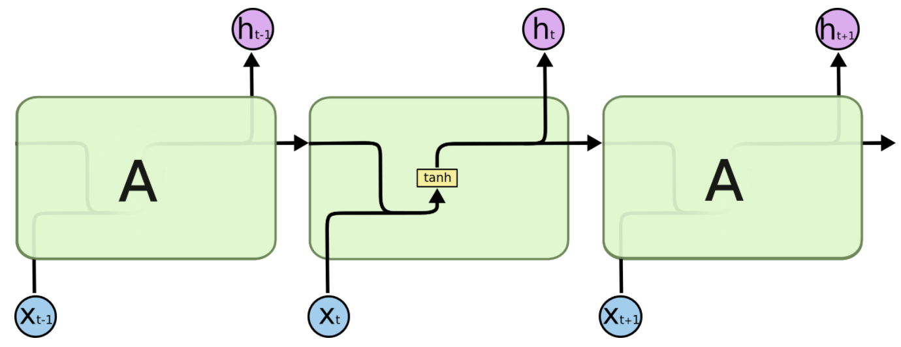

标准RNN中的重复模块的单层神经网络

LSTM也拥有这种链状结构，但是重复模块则拥有不同的结构。与神经网络的简单的一层相比，LSTM拥有四层，这四层以特殊的方式进行交互。

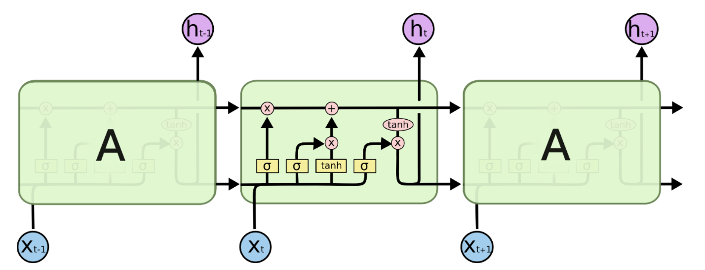

LSTM中的重复模块包含的四层交互神经网络层

不要过早担心细节问题， 稍后我们将一步一步地剖析LSTM。 现在，让我们先熟悉一下我们将要使用的符号。

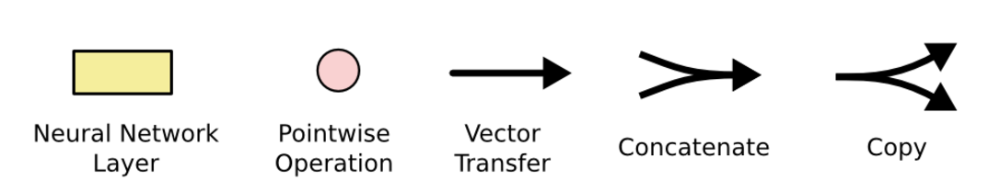

在上图中，每一行都带有一个向量，该向量从一个节点输出到其他节点的输入。 粉红色圆圈表示点向运算，如向量加法、点乘，而黄色框是学习神经网络层。 线的合并表示连接，而线的交叉表示其内容正在复制，副本将转到不同的位置。

## LSTM背后的核心理念

LSTM的关键是细胞状态，表示细胞状态的这条线水平的穿过图的顶部。

细胞的状态类似于输送带，细胞的状态在整个链上运行，只有一些小的线性操作作用其上，信息很容易保持不变的流过整个链。

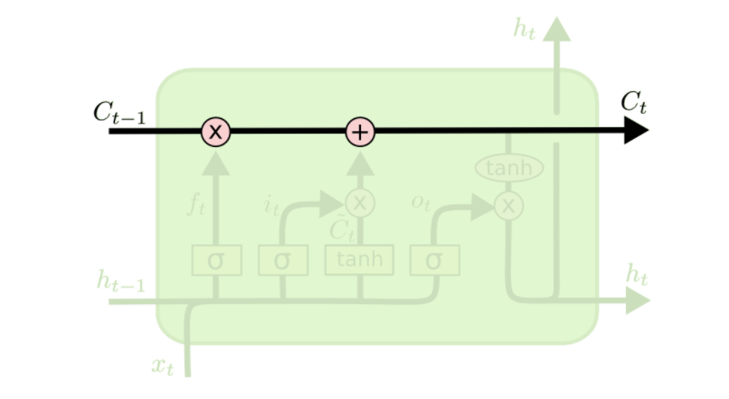

LSTM确实具有删除或添加信息到细胞状态的能力，这个能力是由被称为门(Gate)的结构所赋予的。

门(Gate)是一种可选地让信息通过的方式。 它由一个Sigmoid神经网络层和一个点乘法运算组成。

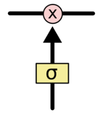

Sigmoid神经网络层输出0和1之间的数字，这个数字描述每个组件有多少信息可以通过， 0表示不通过任何信息，1表示全部通过

LSTM有三个门，用于保护和控制细胞的状态。

## 一步步的拆解LSTM

LSTM的第一步是决定我们要从细胞状态中丢弃什么信息。 该决定由被称为“忘记门”的Sigmoid层实现。它查看ht-1(前一个输出)和xt(当前输入)，并为单元格状态Ct-1(上一个状态)中的每个数字输出0和1之间的数字。1代表完全保留，而0代表彻底删除。

让我们回到语言模型的例子，试图根据以前的语料来预测下一个单词。 在这样的问题中，细胞状态可能包括当前主题的性别，从而决定使用正确的代词。 当我们看到一个新主题时，我们想要忘记旧主题的性别。

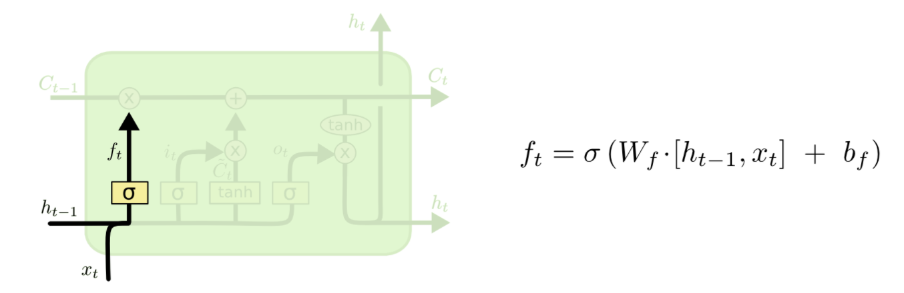

下一步是决定我们要在细胞状态中存储什么信息。 这部分分为两步。 首先，称为“输入门层”的Sigmoid层决定了我们将更新哪些值。 接下来一个tanh层创建候选向量Ct,该向量将会被加到细胞的状态中。 在下一步中，我们将结合这两个向量来创建更新值。

在我们的语言模型的例子中，我们希望将新主题的性别添加到单元格状态，以替换我们忘记的旧对象。

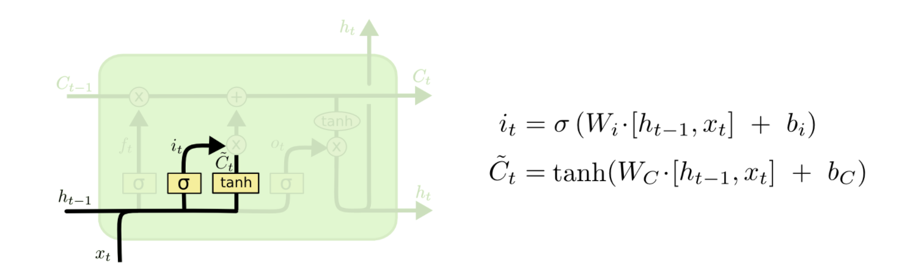

现在是时候去更新上一个状态值Ct−1了，将其更新为Ct。签名的步骤以及决定了应该做什么，我们只需实际执行即可。

我们将上一个状态值乘以ft，以此表达期待忘记的部分。之后我们将得到的值加上 it∗C̃ t。这个得到的是新的候选值， 按照我们决定更新每个状态值的多少来衡量.

在语言模型的例子中，对应着实际删除关于旧主题性别的信息，并添加新信息，正如在之前的步骤中描述的那样。

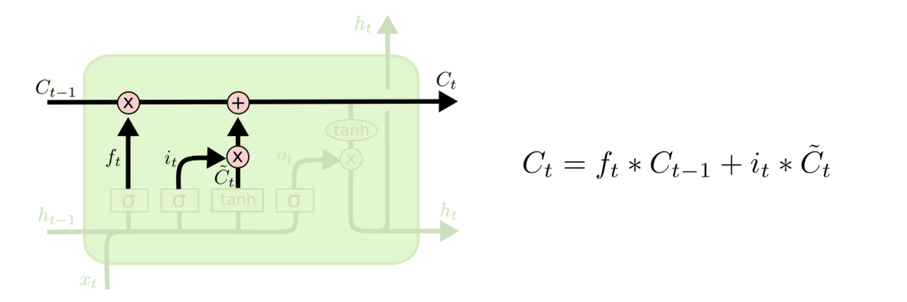

最后，我们需要决定我们要输出什么。 此输出将基于我们的细胞状态，但将是一个过滤版本。 首先，我们运行一个sigmoid层，它决定了我们要输出的细胞状态的哪些部分。 然后，我们将单元格状态通过tanh（将值规范化到-1和1之间），并将其乘以Sigmoid门的输出，至此我们只输出了我们决定的那些部分。

对于语言模型的例子，由于只看到一个主题，考虑到后面可能出现的词，它可能需要输出与动词相关的信息。 例如，它可能会输出主题是单数还是复数，以便我们知道动词应该如何组合在一起。

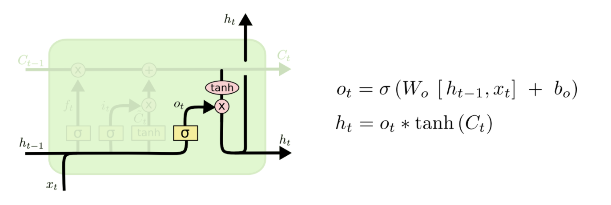

## LSTM的变种(GRU)

到目前为止，所描述的是一个很正常的LSTM。 但并不是所有的LSTM都与上述相同。 事实上，似乎几乎每一篇涉及LSTM的论文都使用了一个略有不同的版本，差异很小，但有一些值得一看。

一个比较流行的LSTM变种是由[Gers & Schmidhuber (2000)](https://link.jianshu.com?t=ftp://ftp.idsia.ch/pub/juergen/TimeCount-IJCNN2000.pdf)提出的，添加“peephole connections”。这意味着，我们允许gate层去看细胞的状态。

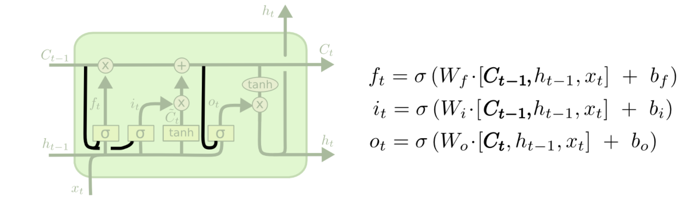

上面的图中所有的Sigmoid层都增加了窥视，但许多论文实现不是针对所有都增加窥探，而是有针对性的增加。

另一种变化是使用耦合的忘记和输入门，而不是单独决定要忘记什么、添加什么，这个决定需要一起做。 只有当需要输入某些信息的时候，我们才会忘记这个位置的历史信息。只有当我们忘记一些历史信息的时候，我们才在状态中添加新的信息。

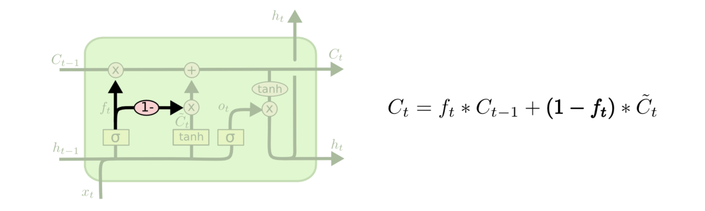

LSTM的一个稍微更显着的变化是由[Cho](https://link.jianshu.com?t=http://arxiv.org/pdf/1406.1078v3.pdf)介绍的门控循环单元(或GRU)。 它将忘记和输入门组合成一个单一的“更新门”。它还将单元格状态和隐藏状态合并，并进行了一些其他更改。 所得到的模型比标准LSTM模型更简单，并且越来越受欢迎。

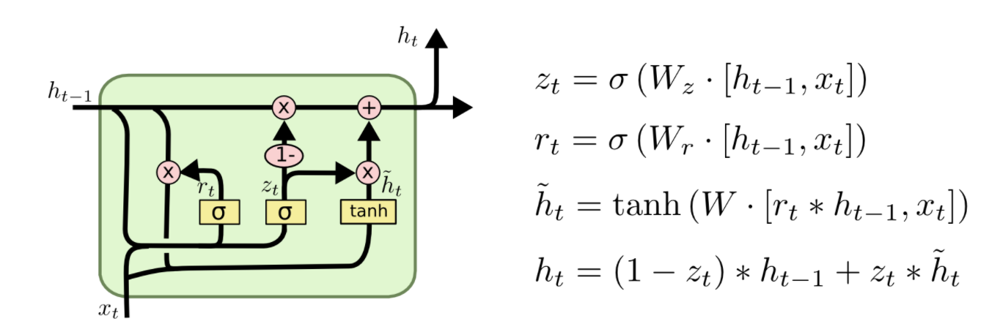

这些只是最显着的LSTM变体中的几个, 还有很多其他的，比如[Depth Gated RNNs](https://link.jianshu.com?t=http://arxiv.org/pdf/1508.03790v2.pdf)，还有一些完全不同的处理长期依赖的方法，例如[Clockwork](https://link.jianshu.com?t=http://arxiv.org/pdf/1402.3511v1.pdf)。哪些变体最好、差异的重要性等， [Greff](https://link.jianshu.com?t=http://arxiv.org/pdf/1503.04069.pdf)做一个很好的变体的比较，发现他们都差不多。 [Jozefowicz](https://link.jianshu.com?t=http://jmlr.org/proceedings/papers/v37/jozefowicz15.pdf)测试了大量的RNN架构，发现一些RNN结构在某些任务上要比LSTM更好。

## 结论

此前，我提到人们通过RNN实现了显着的成果。 基本上所有这些都是使用LSTM实现的。 对于大多数任务而言LSTM很有效。

一般介绍LSTM的文章大部分会写一大组方程式，这使得LSTM看起来很吓人。 希望通过这篇文章的逐步讲解，帮助读者更好的理解LSTM。

LSTM是我们使用RNN的一个巨大进步。 很自然的想法：更大的进步吗？ 研究人员的共同观点是——有，那就是注意力模型。这个想法是让RNN的每一步挑选信息的过程都参照上层的主题信息，关于Attention模型后面我会再进行详尽的描述，这里不再讨论。

希望通过本文让想了解和使用LSTM的人能够了解其工作原理，能更好的使用，不被大量的数学公式和推导所阻碍。

来源：简书    

链接：https://www.jianshu.com/p/4b4701beba92
