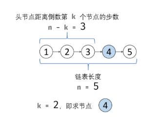

## 题目
输入一个链表，输出该链表中倒数第k个节点。为了符合大多数人的习惯，本题从1开始计数，即链表的尾节点是倒数第1个节点。例如，一个链表有6个节点，从头节点开始，它们的值依次是1、2、3、4、5、6。这个链表的倒数第3个节点是值为4的节点。


## 示例
> 给定一个链表: 1->2->3->4->5, 和 k = 2.
> 返回链表 4->5.

<!--more-->

## 思路



 1. **初始化：** 前指针 <code>former</code> 、后指针 <code>latter</code> ，双指针都指向头节点 head​ 
 2. **构建双指针距离：** 前指针 `former` 先向前走 k 步（结束后，双指针 former 和 latter 间相距 k 步）
 3. **双指针共同移动：** 循环中，双指针 `former` 和`latter` 每轮都向前走一步，直至 `former` 走过链表 尾节点 时跳出（跳出后， `latter` 与尾节点距离为 k-1k−1，即` latter `指向倒数第 kk 个节点）
 4. **返回值：** 返回 `latter` 即可

## 代码
```java
	public class ListNode {    #创建链表
      int val;
      ListNode next;
      ListNode(int x) { val = x; }
	  }
	  
	class Solution {
    	public ListNode getKthFromEnd(ListNode head, int k) {
        ListNode former = head, latter = head;	#定义前指针，后指针
        for(int i = 0; i < k; i++){	#前指针后移k位
            if(former == null) return null;
            former = former.next;
        }
        while(former != null){	#前后指针一起后移，直至前指针为null
            former = former.next;
            latter = latter.next;
        }
        return  latter;
    }
	}
```
