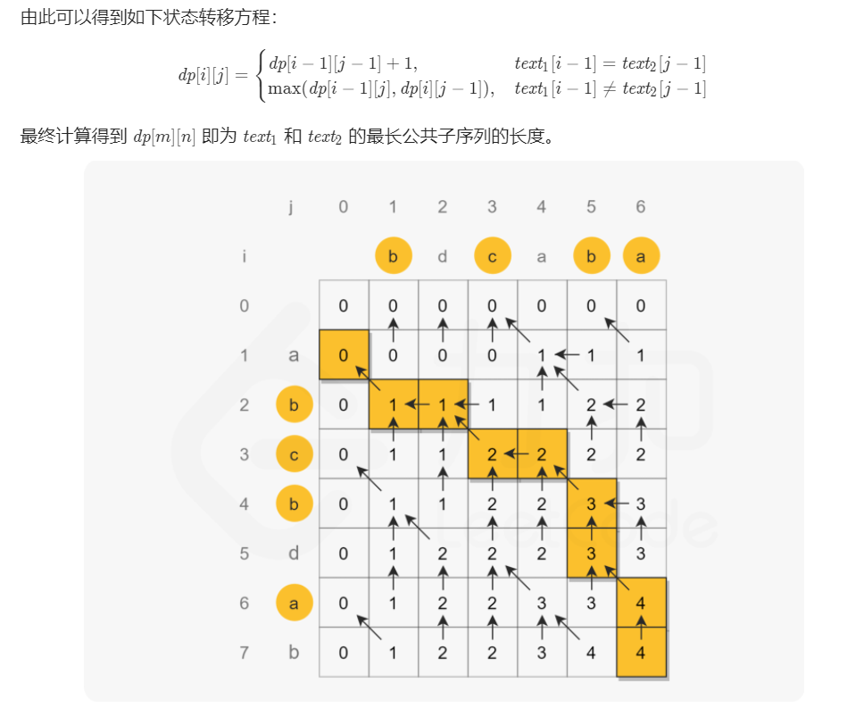

## 题目

给定两个字符串 text1 和 text2，返回这两个字符串的最长 **公共子序列** 的长度。如果不存在 **公共子序列** ，返回 0 。

一个字符串的 **子序列** 是指这样一个新的字符串：它是由原字符串在不改变字符的相对顺序的情况下删除某些字符（也可以不删除任何字符）后组成的新字符串。

- 例如，"ace" 是 "abcde" 的子序列，但 "aec" 不是 "abcde" 的子序列。

两个字符串的 公共子序列 是这两个字符串所共同拥有的子序列。

## 示例

> 输入：text1 = "abcde", text2 = "ace" 
>    
>输出：3
> 
>解释：最长公共子序列是 "ace" ，它的长度为 3 。
> 

<!--more-->

## 限制

- `1 <= text1.length, text2.length <= 1000`
- `text1` 和 `text2` 仅由小写英文字符组成。

## 思路

LRU 缓存机制可以通过哈希表辅以双向链表实现，我们用一个哈希表和一个双向链表维护所有在缓存中的键值对。

双向链表按照被使用的顺序存储了这些键值对，靠近头部的键值对是最近使用的，而靠近尾部的键值对是最久未使用的。

哈希表即为普通的哈希映射（HashMap），通过缓存数据的键映射到其在双向链表中的位置。



## 代码

```java
class Solution {
    public int longestCommonSubsequence(String text1, String text2) {
        int m = text1.length(), n = text2.length();
        int[][] dp = new int[m + 1][n + 1];
        for (int i = 1; i <= m; i++) {
            char c1 = text1.charAt(i - 1);
            for (int j = 1; j <= n; j++) {
                char c2 = text2.charAt(j - 1);
                if (c1 == c2) {
                    dp[i][j] = dp[i - 1][j - 1] + 1;
                } else {
                    dp[i][j] = Math.max(dp[i - 1][j], dp[i][j - 1]);
                }
            }
        }
        return dp[m][n];
    }
}
```


