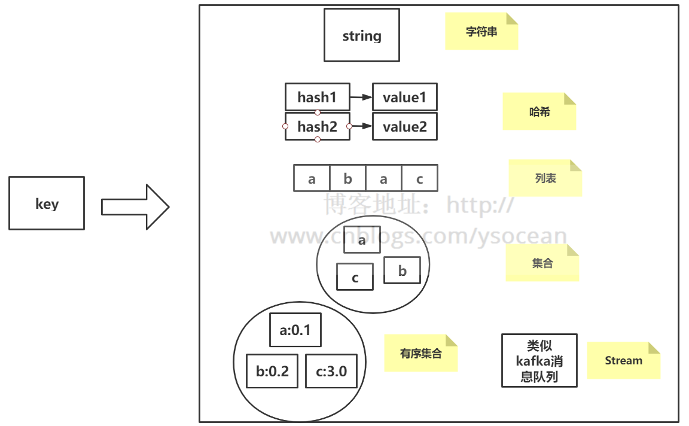
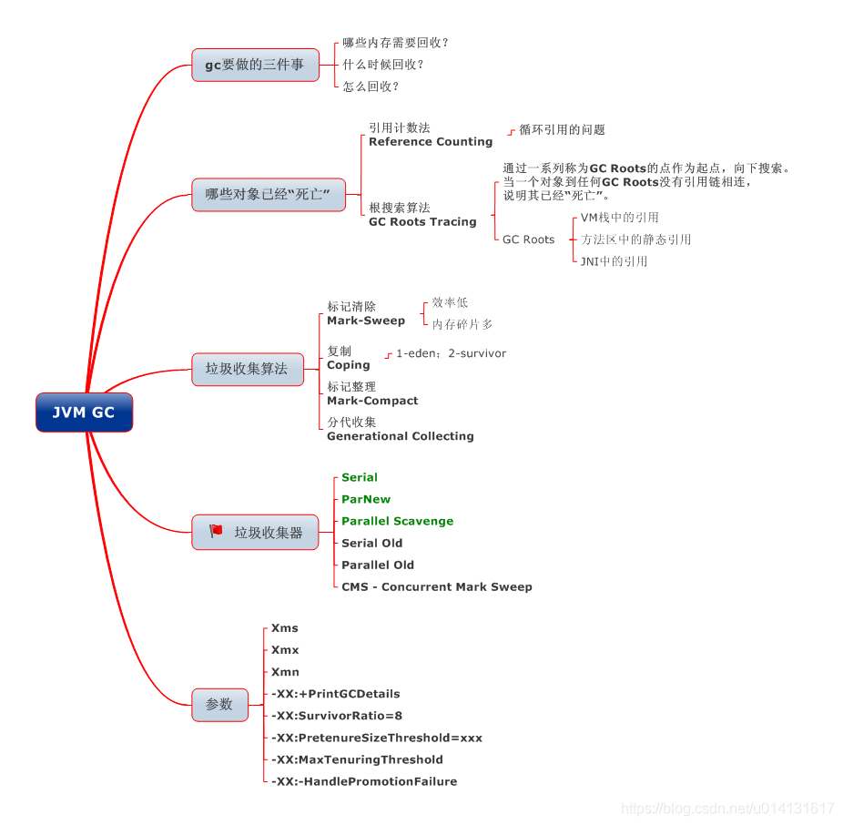

## Java 基本功

### Java入门

#### **面向过程和面向对象的区别**
 - **面向过程：面向过程性能比面向对象高**。因为类调用时需要实例化，开销比较大，比较消耗资源，所以当性能是最重要的考量因素的时候，比如单片机、嵌入式开发、Linux/Unix 等一般采用面向过程开发。但是，**面向过程没有面向对象易维护、易复用、易扩展**。
 - **面向对象：面向对象易维护、易复用、易扩展**。因为面向对象有封装、继承、多态性的特性，所以可以设计出低耦合的系统，使系统更加灵活、更加易维护。但是，**面向对象性能比面向过程低**。
<!--more-->

----------

#### **Java语言有哪些特点?**

 - 简单易学；
 - 面向对象（封装，继承，多态）；
 - 平台无关性（Java虚拟机实现平台无关性）；
 - 可靠性；
 - 安全性；
 - 支持多线程；
 - 支持网络编程并且很方便；
 - 编译和解释并存；

----------

#### **Java 和 C++ 的区别**
 - 都是面向对象语言，都支持封装、继承和多态
 - Java不提供指针来直接访问内存，程序内存更加安全
 - Java的类是单继承的，C++支持多重继承；虽然Java的类不可以多继承，但是接口可以多继承
 - Java有自动内存管理机制，不需要程序员手动释放无用内存
 - **在C语言中，字符串或字符数组最后都会有一个额外的字符‘\0’来表示结束。但是，Java语言中没有结束符这个概念**

---

#### **ArrayList，LinkedList 和 Vector的区别**

1. **ArrayList是最常用的List实现类，内部通过数组实现的，**它允许对元素进行随机访问。数组的缺点是每个元素之间不能有间隔，当数组大小不满足时需要增加存储能力。当从ArrayList的中间位置插入或者删除元素时，需要对数组进行复制、移动、代价比较高。因此，它适合随机查找和遍历，不适合插入和删除。
2. **Vector与ArrayList一样，也是通过数组实现的，**不同的是它支持线程的同步，即某一时刻只有一个线程能够写Vector，但实现同步需要很高的花费，因此，访问它比访问ArrayList慢。
3. **LinkedList是采用链表结构存储数据的，**很适合数据的动态插入和删除，但随机访问和遍历速度比较慢。另外，他还提供了List接口中没有定义的方法，专门用于操作表头和表尾元素，可以当作堆栈、队列和双向队列使用

---

#### **HashMap、Hashtable、LinkedHashMap、ConcurrentHashMap 和 TreeMap之间的区别**

1. **HashMap**是一个最常用的Map，它根据键的hashCode值存储数据，根据键可以直接获取它的值，具有很快的访问速度。HashMap最多只允许一条记录的键为null，不允许多条记录的值为null。HashMap不支持线程的同步，即任一时刻可以有多个线程同时写HashMap，可能会导致数据的不一致。如果需要同步，可以用Collections.synchronizedMap(HashMap map)方法使HashMap具有同步的能力。

|  No  |        HashMap        |       HashTable       |
| :--: | :-------------------: | :-------------------: |
|  1   | 继承的是AbstractMap类 | 继承的的是Dicionary类 |
|  2   |      非线程安全       |       线程安全        |
|  3   |   允许存在null的key   |    不允许存在空key    |

1. **LinkedHashMap**保存了记录的插入顺序，在用Iteraor遍历LinkedHashMap时，先得到的记录肯定是先插入的。在遍历的时候会比HashMap慢。有HashMap的全部特性。
2. **TreeMap**能够把它保存的记录根据键排序，默认是按升序排序，也可以指定排序的比较器。当用Iteraor遍历TreeMap时，得到的记录是排过序的。TreeMap的键和值都不能为空。
3. **ConcurrentHashMap**是无锁多线程编程所提供的一个集合组合，是基于cpu层面的CAS原子操作，用到这个操作，只需要在取队列元素和添加队列元素的时候利用CAS原子操作，就可以保证多个线程对队列元素的有序存取

---

#### **Object类有哪些方法？各有什么作用？**

1. **clone方法**

保护方法，实现对象的浅复制，只有实现了Cloneable接口才可以调用该方法，否则抛出CloneNotSupportedException异常。

主要是JAVA里除了8种基本类型传参数是值传递，其他的类对象传参数都是引用传递，我们有时候不希望在方法里讲参数改变，这是就需要在类中复写clone方法。

2. **getClass方法**

final方法，获得运行时类型。

3. **toString方法**

该方法用得比较多，一般子类都有覆盖。

4. **finalize方法**

该方法用于释放资源。因为无法确定该方法什么时候被调用，很少使用。

5. **equals方法**

该方法是非常重要的一个方法。一般equals和==是不一样的，但是在Object中两者是一样的。子类一般都要重写这个方法。

6. **hashCode方法**

该方法用于哈希查找，可以减少在查找中使用equals的次数，重写了equals方法一般都要重写hashCode方法。这个方法在一些具有哈希功能的Collection中用到。

一般必须满足obj1.equals(obj2)==true。可以推出obj1.hash- Code()==obj2.hashCode()，但是hashCode相等不一定就满足equals。不过为了提高效率，应该尽量使上面两个条件接近等价。

如果不重写hashcode(),在HashSet中添加两个equals的对象，会将两个对象都加入进去。

7. **wait方法**

wait方法就是使当前线程等待该对象的锁，当前线程必须是该对象的拥有者，也就是具有该对象的锁。wait()方法一直等待，直到获得锁或者被中断。wait(long timeout)设定一个超时间隔，如果在规定时间内没有获得锁就返回。

调用该方法后当前线程进入睡眠状态，直到以下事件发生。

（1）其他线程调用了该对象的notify方法。

（2）其他线程调用了该对象的notifyAll方法。

（3）其他线程调用了interrupt中断该线程。

（4）时间间隔到了。

此时该线程就可以被调度了，如果是被中断的话就抛出一个InterruptedException异常。

8. **notify方法**

该方法唤醒在该对象上等待的某个线程。

9. **notifyAll方法**

该方法唤醒在该对象上等待的所有线程。

----------

#### **Redis的数据类型**

Redis支持五种数据类型：string（字符串），hash（哈希），list（列表），set（集合）及zset(sorted set：有序集合)。

[Redis详解（三）------ redis的六大数据类型详细用法]: https://www.cnblogs.com/ysocean/p/9080940.html

1. **String（字符串）**		

string 是 redis 最基本的类型，你可以理解成与 Memcached 一模一样的类型，一个 key 对应一个 value。

string 类型是二进制安全的。意思是 redis 的 string 可以包含任何数据。比如jpg图片或者序列化的对象。

string 类型是 Redis 最基本的数据类型，string 类型的值最大能存储 512MB。

2. **Hash（哈希）**

Redis hash 是一个键值(key=>value)对集合。

Redis hash 是一个 string 类型的 field 和 value 的映射表，hash 特别适合用于存储对象。

3. **List（列表）**

Redis 列表是简单的字符串列表，按照插入顺序排序。你可以添加一个元素到列表的头部（左边）或者尾部（右边）。

4. **Set（集合）**

   Redis 的 Set 是 string 类型的无序集合。

   集合是通过哈希表实现的，所以添加，删除，查找的复杂度都是 O(1)。

5. **zset(sorted set：有序集合)**

   Redis zset 和 set 一样也是string类型元素的集合,且不允许重复的成员。

   不同的是每个元素都会关联一个double类型的分数。redis正是通过分数来为集合中的成员进行从小到大的排序。

   zset的成员是唯一的,但分数(score)却可以重复。

---

#### **Redis数据类型的底层数据结构**

简单动态字符串、链表、字典、跳跃表、整数集合、压缩列表

[Redis详解（四）------ redis的底层数据结构]: https://www.cnblogs.com/ysocean/p/9080942.html

---

#### Redis持久化机制

[详解Redis中两种持久化机制RDB和AOF（面试常问，工作常用）]: https://baijiahao.baidu.com/s?id=1654694618189745916&amp;wfr=spider&amp;for=pc

----------

#### JVM的CMS的步骤？为什么要执行第二部的并发标记？

---------

#### GCRoot的对象有哪些？

--------

#### **volatile的实现原理？**

volatile通常被比喻成"轻量级的synchronized"，也是Java并发编程中比较重要的一个关键字。和synchronized不同，volatile是一个变量修饰符，只能用来修饰变量。无法修饰方法及代码块等。

volatile的用法比较简单，只需要在声明一个可能被多线程同时访问的变量时，使用volatile修饰就可以了。

**volatile的原理：**为了提高处理器的执行速度，在处理器和内存之间增加了多级缓存来提升。但是由于引入了多级缓存，就存在缓存数据不一致问题。

但是，对于volatile变量，当对volatile变量进行写操作的时候，JVM会向处理器发送一条lock前缀的指令，将这个缓存中的变量回写到系统主存中。

但是就算写回到内存，如果其他处理器缓存的值还是旧的，再执行计算操作就会有问题，所以在多处理器下，为了保证各个处理器的缓存是一致的，就会实现缓存一致性协议

缓存一致性协议：每个处理器通过嗅探在总线上传播的数据来检查自己缓存的值是不是过期了，当处理器发现自己缓存行对应的内存地址被修改，就会将当前处理器的缓存行设置成无效状态，当处理器要对这个数据进行修改操作的时候，会强制重新从系统内存里把数据读到处理器缓存里。

所以，如果一个变量被volatile所修饰的话，在每次数据变化之后，其值都会被强制刷入主存。而其他处理器的缓存由于遵守了缓存一致性协议，也会把这个变量的值从主存加载到自己的缓存中。这就保证了一个volatile在并发编程中，其值在多个缓存中是可见的。

---

#### 常见排序算法及其对应的时间复杂度和空间复杂度

[常见排序算法及其对应的时间复杂度和空间复杂度]: https://www.cnblogs.com/zwtgyh/p/10631760.html

---

**GC垃圾回收算法**

---

#### HashMap为什么线程不安全？ConcurrentHashMap的原理？

首先我们之前说到过 HashMap 在第一次 put 的时候，会进行哈希数组的初始化，我们想想这次会有线程安全问题么？肯定有呀，要是两个线程同时对 HashMap 进行初始化，那么我们不就有了两个 哈希数组了么？

[剖析HashMap的线程不安全到ConCurrentHashMap如何保证其安全性]: https://blog.csdn.net/newbie0107/article/details/101164483

---

#### synchronized的原理？

---

#### 分布式锁有哪些实现方式？

---

#### [redis](https://www.nowcoder.com/jump/super-jump/word?word=redis)怎么实现分布式锁？

---

#### 给了一个[redis](https://www.nowcoder.com/jump/super-jump/word?word=redis)分布式锁的场景，问是否发生死锁？

---

#### [redis](https://www.nowcoder.com/jump/super-jump/word?word=redis)分布式锁除了设置过期时间外，还有什么办法可以解决死锁？

---

#### Zookepeer又怎么实现分布式锁?

---

#### 分布式事务有哪些实现方式？

---

